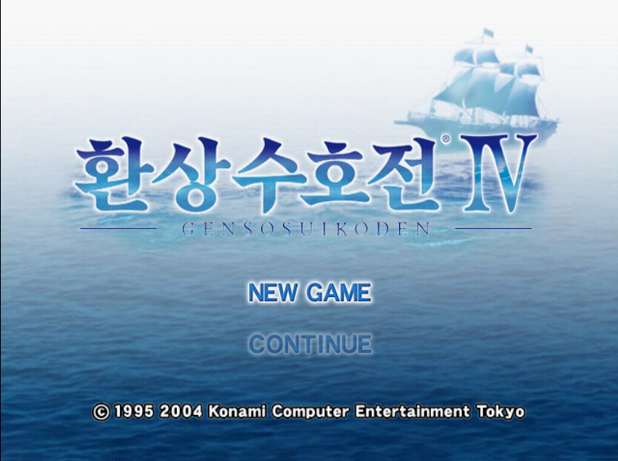

# 환상수호전 IV 한국어 패치 (Suikoden IV Korean Patch)



PS2 일본판 幻想水滸伝IV (Genso Suikoden IV)용 비공식 한국어 번역 패치입니다.
게임 ISO는 배포하지 않으며, 본인이 가진 원본 ISO에 적용하는 xdelta 차분 패치만 제공합니다.

> **v0.1.1은 테스트 버전입니다.** 번역·표시 검수가 진행 중이며, 초반 구간 위주로 실제 플레이 확인을 했습니다.
> 오역, 어색한 문구, 칸을 넘는 UI, 멈춤 현상 등이 남아 있을 수 있습니다.

## 지원 원본

| 항목 | 값 |
|---|---|
| 게임 | 幻想水滸伝IV (일본판) |
| 파일 | 원본 ISO 이미지 1개 |
| 크기 | 4,324,229,120 바이트 |
| SHA-256 | `dc1afbae565dbe4e0bb5cd6a4383baca3d0acdc36d822bc9532cb9477dde8103` |

해시가 다르면 패치가 적용되지 않거나 결과가 달라집니다. 적용 전에 원본 해시를 꼭 확인해 주세요.

## 패치 파일

| 파일 | 크기 | SHA-256 |
|---|---|---|
| `Suikoden4_KR_v0.1.1.xdelta` | 3,989,249 바이트 | `1277a1cda20e2a639f3cc4c94bbeeae12cdd1158a55609e78a410dd680e454e8` |

## 적용 방법

### xdelta UI / Delta Patcher (Windows)
1. `Suikoden4_KR_v0.1.1.xdelta`를 받습니다.
2. xdelta UI 또는 Delta Patcher에서 **Patch**에 xdelta 파일, **Source**에 원본 ISO를 지정합니다.
3. 결과 파일 이름을 정하고 적용합니다.

### xdelta3 명령줄
```
xdelta3 -d -s 원본.iso Suikoden4_KR_v0.1.1.xdelta 결과.iso
```

### 적용 결과 확인

| 항목 | 값 |
|---|---|
| 크기 | 4,331,266,048 바이트 |
| SHA-256 | `20fe351a3c674ec35b11a832d409abf57293ed391efbd51a639586ef1b85847d` |

## 현재 상태 (v0.1.1)

- 대사·선택지·메뉴·아이템·팝업 등 게임 내 텍스트를 한국어로 표시합니다. 일부 문구는 초벌 번역 단계입니다.
- 지역명 중 일부는 아직 검수 전 초안입니다.
- 한글 표시를 위해 게임 실행 파일과 글꼴·UI 코드 일부를 수정했습니다.
- 확인 환경: PCSX2 에뮬레이터. 실기(PS2)에서는 확인하지 않았습니다.

### 알려진 문제
- 긴 로딩 중 NOW LOADING 애니메이션에 가끔 깨진 프레임이 스칠 수 있습니다.
- 초반 이후 구간은 UI 폭·문구 확인이 충분하지 않습니다.

문제를 발견하면 Issues에 스크린샷과 함께 알려 주세요.

## 변경 이력

### v0.1.1 (2026-09-18)
- 미니게임(바질의 팽이 게임 등) 소지금 창에서 금액 자리에 줄무늬가 화면 끝까지 그려지던 문제를 고쳤습니다. "포치" 글자도 제대로 표시됩니다.
- 그 밖의 대사·메뉴·화면은 v0.1.0과 같습니다. 해당 미니게임을 하지 않는다면 바로 업데이트하지 않아도 진행에 지장이 없습니다.
- 패치는 원본 ISO에 적용합니다. v0.1.0을 적용한 ISO에는 적용할 수 없습니다.

### v0.1.0 (2026-09-18)
- 첫 테스트 릴리스.

## 글꼴

한글 글꼴은 **Noto Sans KR 2.004**을 게임 글꼴 형식으로 변환해 사용합니다.
Noto Sans KR은 [SIL Open Font License 1.1](https://openfontlicense.org/open-font-license-official-text/)에 따라 배포됩니다.

## 면책

- 이 프로젝트는 팬 번역이며 Konami와 관련이 없습니다.
- 幻想水滸伝(Suikoden)과 관련 상표·저작물의 권리는 각 권리자에게 있습니다.
- 게임 ISO, BIOS, 원본 데이터는 제공하지 않습니다. 본인이 소유한 원본으로만 사용해 주세요.
- 패치 사용으로 생긴 문제에 대해 책임지지 않습니다.
